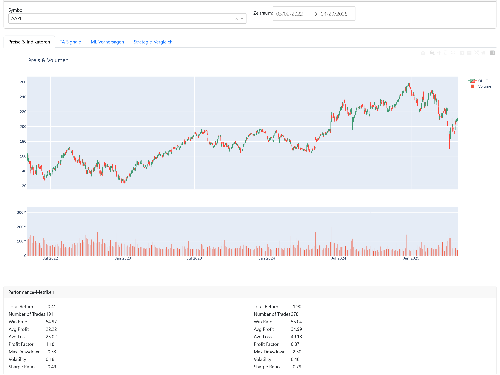
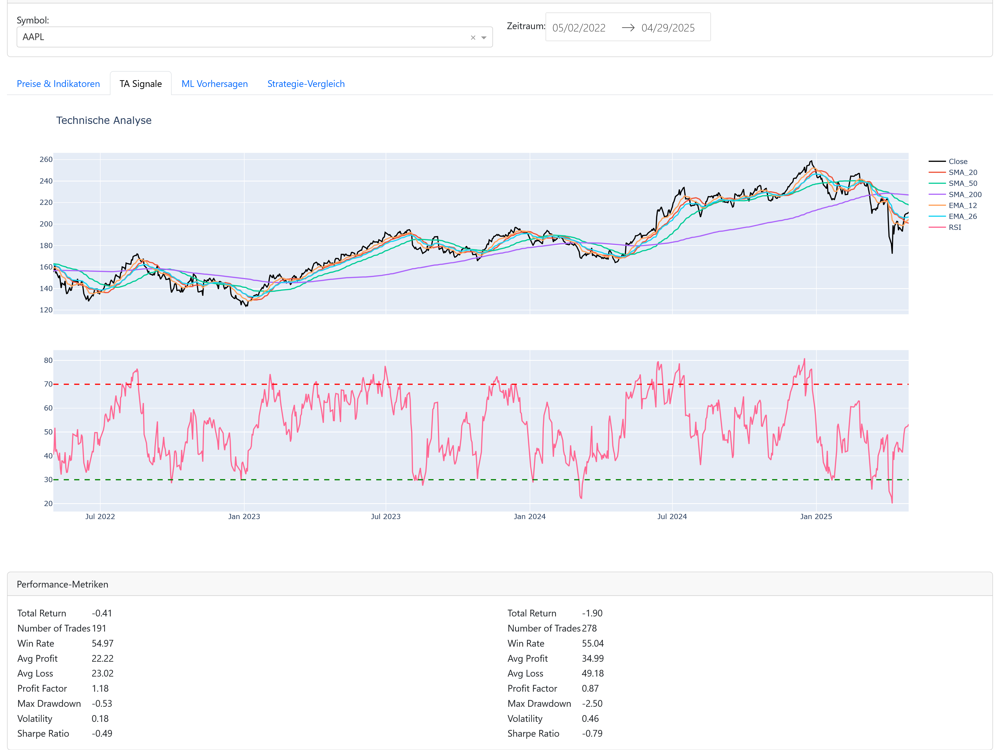
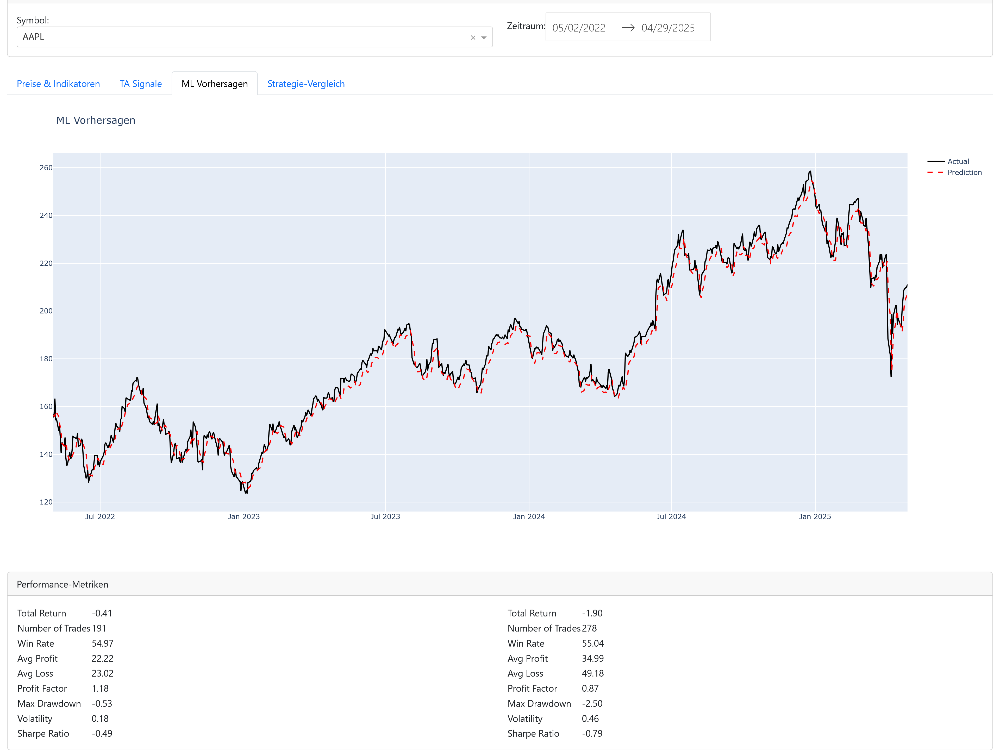
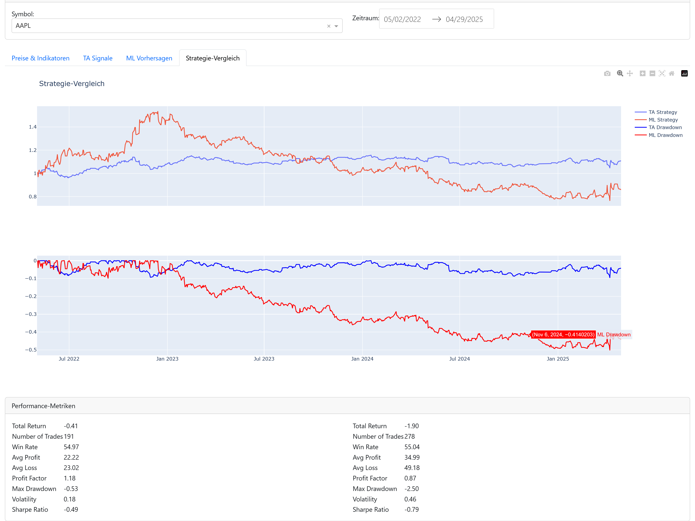

# NextTick Trading System

Ein modernes Trading-System mit technischer Analyse und LSTM-basierter Preisvorhersage.

## Features

- **Datenbeschaffung**: Automatisiertes Laden von Marktdaten via yfinance
- **Technische Analyse**: Berechnung wichtiger Indikatoren (SMA, EMA, RSI, MACD, Bollinger Bands)
- **Machine Learning**: LSTM-Modell für Preisvorhersagen mit PyTorch
- **Backtesting**: Robuste Engine für Strategievergleiche
- **Visualisierung**: Interaktives Dashboard mit Plotly/Dash
- **Performance-Metriken**: Umfassende Analyse von Rendite, Risiko und Drawdown

## Screeshots


**Preis-Volumen**
- Preisübersicht der ausgewählten Aktie
- Volumen der ausgewählten Aktie


**technische Analyse**
- Aktienverluaf im ausgewählten Zeitraum
- SMA 20
- SMA 50
- SMA 200
- EMA 12
- EMA 26
- RSI


**Machine Learning Vorhersage**
- Aktienverluaf im ausgewählten Zeitraum
- Vorhersage des Aktienverluafs


**Strategie Vergleich**
- Trading Vergleich Technische Analyse vs. Machine Learning Analyse
- TA Stategy
- TA Drawdown
- ML Stategy
- ML Drawdown

## Projektstruktur

Die detaillierte Projektstruktur finden Sie in der [project_structure.md](./project_structure.md) Datei.

## Installation

1. Python-Umgebung erstellen (Python 3.9+ erforderlich):
```bash
python -m venv .venv
```

2. Umgebung aktivieren:
```bash
# Windows
.venv\Scripts\activate

# Linux/Mac
source .venv/bin/activate
```

3. Abhängigkeiten installieren:
```bash
uv pip install -r requirements.txt
```

4. Pre-commit Hooks installieren:
```bash
pre-commit install
```

## Verwendung

### Daten laden

```bash
python -m nexttick.main download AAPL MSFT GOOGL --days 365
```

### Technische Analyse durchführen

```bash
python -m nexttick.main analyze AAPL MSFT GOOGL
```

### LSTM-Modell trainieren

```bash
python -m nexttick.main train AAPL MSFT GOOGL --epochs 100
```

### Backtesting durchführen

```bash
python -m nexttick.main backtest AAPL MSFT GOOGL
```

### Dashboard starten

```bash
python -m nexttick.main dashboard --port 8050
```

## Projektstruktur

```
nexttick/
├── data/               # Rohdaten und verarbeitete Daten
├── src/
│   └── nexttick/
│       ├── data/      # Datenbeschaffung
│       ├── ta/        # Technische Analyse
│       ├── ml/        # Machine Learning
│       ├── compare/   # Strategievergleich
│       ├── backtest/  # Backtesting-Engine
│       └── dashboard/ # Web-Interface
├── tests/             # Unit- und Integrationstests
├── docs/             # Dokumentation
└── notebooks/        # Jupyter Notebooks
```

## Entwicklung

### Tests ausführen

```bash
pytest tests/ -v
```

### Code formatieren

```bash
black src/ tests/
isort src/ tests/
```

### Typ-Checks

```bash
mypy src/
```

## Konfiguration

Die Konfiguration erfolgt über die `config.py`. Wichtige Parameter:

- Trading-Parameter (Lookback-Periode, Train/Test-Split, etc.)
- Technische Indikatoren (Perioden für MA, RSI, etc.)
- LSTM-Modell (Batch-Size, Learning Rate, etc.)
- Backtesting (Kommission, Slippage, etc.)

## Performance-Metriken

Das System berechnet folgende Metriken:

- Gesamtrendite und annualisierte Rendite
- Sharpe Ratio und Volatilität
- Maximum Drawdown
- Win Rate und Profit Factor
- Trade-Statistiken (Anzahl, Durchschnittsgewinn/-verlust)

## Lizenz

MIT

## Beitragen

1. Fork erstellen
2. Feature Branch erstellen (`git checkout -b feature/AmazingFeature`)
3. Änderungen committen (`git commit -m 'Add some AmazingFeature'`)
4. Branch pushen (`git push origin feature/AmazingFeature`)
5. Pull Request erstellen

## Mögliche Erweiterungen & ToDos

Im Folgenden sind sinnvolle Erweiterungen und offene Aufgaben für das NextTick-Projekt aufgeführt. Diese Liste dient als Orientierung für die Weiterentwicklung und Priorisierung:

### 1. Daten & Datenquellen
- [ ] Unterstützung weiterer Datenquellen (z.B. Alpha Vantage, Quandl, Binance)
- [ ] Automatisierte Aktualisierung und Zeitplanung für Daten-Downloads
- [ ] Erweiterung um fundamentale Daten (z.B. Unternehmenskennzahlen)

### 2. Technische Analyse & Features
- [ ] Hinzufügen weiterer technischer Indikatoren (z.B. Stochastic, ADX, CCI)
- [ ] Feature-Engineering: Kombination und Transformation bestehender Features
- [ ] Automatische Feature-Selektion und -Optimierung

### 3. Machine Learning & Modelle
- [ ] Integration weiterer ML-Modelle (z.B. Random Forest, XGBoost, Transformer)
- [ ] Hyperparameter-Optimierung automatisieren (z.B. mit Optuna)
- [ ] Cross-Validation und Robustheitstests für Modelle
- [ ] Modell-Explainability (z.B. SHAP, LIME)

### 4. Backtesting & Strategieentwicklung
- [ ] Erweiterung der Backtesting-Engine um Stop-Loss/Take-Profit, Trailing Stops
- [ ] Portfolio-Backtesting (mehrere Assets gleichzeitig, Gewichtung)
- [ ] Berücksichtigung von Handelskosten, Slippage und Liquidität realistischer gestalten
- [ ] Visualisierung von Trade-Historien und Entry/Exit-Punkten

### 5. Dashboard & Visualisierung
- [ ] Erweiterung des Dashboards um weitere Visualisierungen (z.B. Korrelationsmatrix, Heatmaps)
- [ ] Interaktive Parametersteuerung (z.B. Schwellenwerte für Signale, Modellwahl)
- [ ] Benutzerverwaltung und Authentifizierung für das Dashboard

### 6. Infrastruktur & Qualität
- [ ] Unit- und Integrationstests für alle Module ergänzen
- [ ] Continuous Integration (CI) einrichten (z.B. GitHub Actions)
- [ ] Automatisierte Dokumentation (z.B. mit Sphinx, ReadTheDocs)
- [ ] Logging und Monitoring verbessern (z.B. Fehlerbenachrichtigung, Performance-Tracking)

### 7. Sonstiges
- [ ] Beispiel-Notebooks für typische Workflows und Analysen bereitstellen
- [ ] Tutorials und Schritt-für-Schritt-Anleitungen für neue Nutzer
- [ ] Internationalisierung (mehrsprachige Oberfläche und Dokumentation)

Diese Liste kann nach Bedarf erweitert und priorisiert werden. Vorschläge und Beiträge sind willkommen!